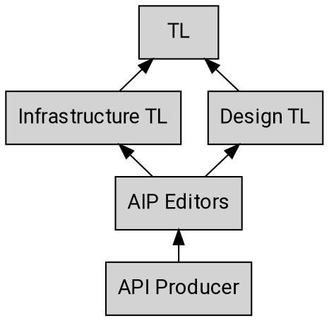
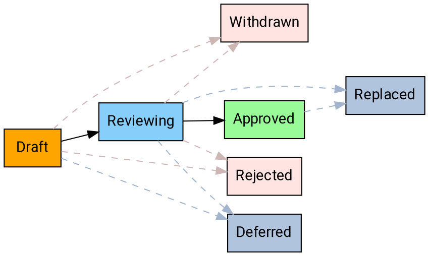

---
aip:
  id: 1
  state: approved
  created: 2018-08-20
  updated: 2019-05-04
  type: process
js:
  - /assets/js/graphviz/viz.js
  - /assets/js/graphviz/lite.render.js
  - /assets/js/aip/aip-graphviz.js
permalink: /1
redirect_from:
  - /01
  - /001
  - /0001
---

## What is an AIP?

AIP stands for **API Improvement Proposal**, which is a design document
providing high-level, concise documentation for API development. AIPs
are maintained as Markdown files in the [AIP GitHub repository][].

## Types of AIPs

There are several different types of AIPs, described below. The list of AIP
types may evolve over time as necessary.

### Guidance

These AIPs describe guidance on API design. These are provided as instruction
for API producers to help write simple, intuitive, and consistent APIs, and are
used by API reviewers as a basis for review comments.

### Process

These AIPs describe a process surrounding API design. They often affect the AIP
process itself and are used to enhance the way in which AIPs are handled.

## Stakeholders

As with any process there are many different stakeholders when it comes to
reviewing and working with AIPs. Below is a summary of the escalation path
starting with the API producer.

## Domain-specific AIPs

Some AIPs may be specific to a particular domain (for example, only to APIs
within a certain PA, or even a certain team). In this situation, the group will
be given a particular block of AIPs to use in accordance with [AIP-2][], and
the applicable AIPs will clearly indicate their scope.

## States

At any given time, AIPs may exist in a variety of states as they work their way
through the process. The following is a summary of each state.

## Workflow

The following workflow describes the process for proposing an AIP, and moving
an AIP from proposal to implementation to final acceptance.

### Overview

### Proposing an AIP

In order to propose an AIP, first [open an issue][] to circulate the
fundamental idea for initial feedback. It should generally be possible to
describe the idea in a couple of pages.

Once ready, create a PR with a new file in the AIP directory using a file
titled `aip/new.md`. Ensure that the PR is editable by maintainers.

In most circumstances, the editors will assign the proposal an AIP number and
submit the PR with the AIP in the "Reviewing" state. The editors may reject an
AIP outright if they have an obvious reason to do so (e.g. the proposal was
already discussed and rejected in another AIP or is fundamentally unsound), in
which case the PR is not merged.

## Changelog

- **2019-05-04**: Updated the AIP to refer to GitHub processes, rather than
  internal processes.

[aip-2]: ./0002.md
[aip github repository]: https://github.com/michalwronski/michalwronski.github.io/
[open an issue]: https://github.com/michalwronski/michalwronski.github.io/issues
